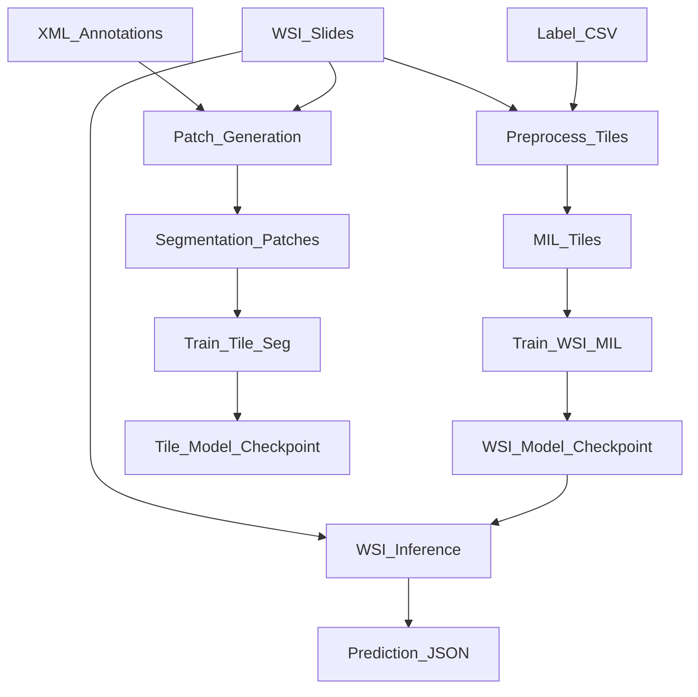

# Architecture

KidPro has two training paths that share the same WSI inputs:

- Patch segmentation path: XML + SVS -> patches + masks -> tile model training.
- MIL path: WSI + labels -> tiled bags -> slide-level classifier training.

Key components:

- `kidpro.patch`: generates image+mask patches from annotations.
- `kidpro.preprocessing`: creates MIL tiles from WSIs.
- `kidpro.train_tile`: trains segmentation on patches.
- `kidpro.train_wsi`: trains WSI MIL classifier on tiles.
- `kidpro.infer_wsi`: tiles a WSI (if needed) and runs classification.

See also: `overview.md`, `training.md`, `inference.md`.
