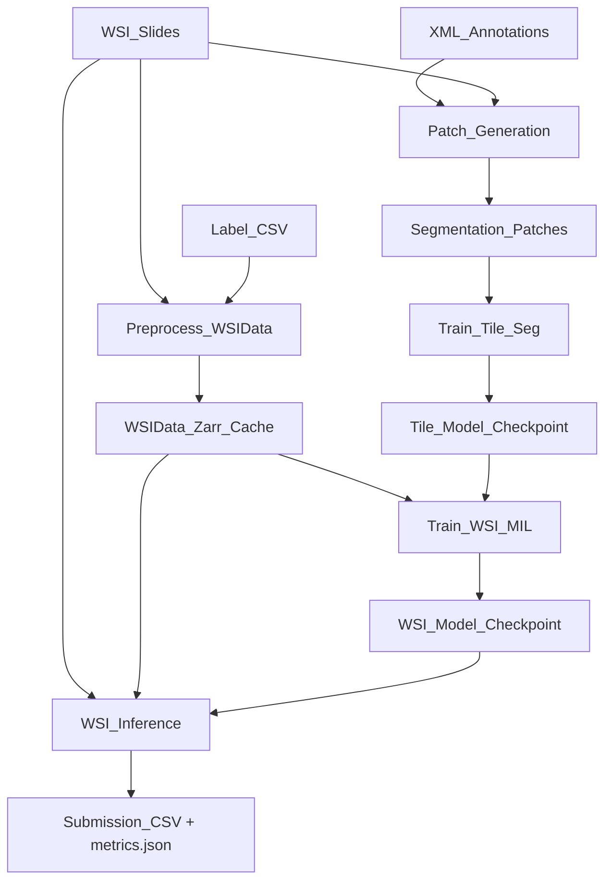

# Architecture

KidPro has two training paths that share the same WSI inputs:

- Patch segmentation path: XML + SVS -> patches + masks -> tile model training.
- MIL path: WSI + labels -> wsidata cache -> slide-level classifier training.

```mermaid
flowchart TD
  WSI[WSI_Slides] --> Preprocess[Preprocess_WSIData]
  Labels[Label_CSV] --> Preprocess
  Preprocess --> WSIDataCache[WSIData_Zarr_Cache]
  WSIDataCache --> TrainWSI[Train_WSI_MIL]
  TrainWSI --> WSIModel[WSI_Model_Checkpoint]

  XML[XML_Annotations] --> PatchGen[Patch_Generation]
  WSI --> PatchGen
  PatchGen --> PatchDataset[Segmentation_Patches]
  PatchDataset --> TrainTile[Train_Tile_Seg]
  TrainTile --> TileModel[Tile_Model_Checkpoint]
  TileModel --> TrainWSI

  WSI --> Inference[WSI_Inference]
  WSIDataCache --> Inference
  WSIModel --> Inference
  Inference --> Prediction[Submission_CSV + metrics.json]
```

Key components:

- `kidpro.patch`: generates image+mask patches from annotations.
- `kidpro.preprocessing`: creates wsidata cache and optional patches from WSIs.
- `kidpro.train_tile`: trains segmentation on patches.
- `kidpro.train_wsi`: trains WSI MIL classifier on wsidata tiles.
- `kidpro.infer_ensem`: runs WSI inference from a CSV (optional checkpoint ensembling).

See also: [overview.md](overview.md), [training.md](training.md), [inference.md](inference.md), [data.md](data.md).
